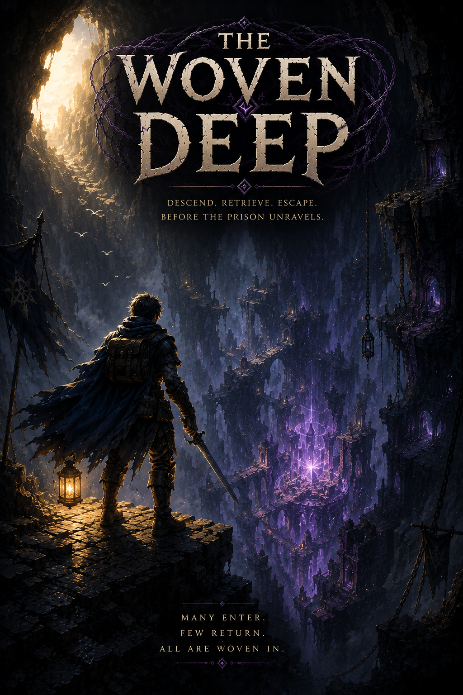

# The Woven Deep



A dark fantasy roguelike in the spirit of classic Rogue.

> Many enter.
> Few return.
> All are woven in.

## The story

Long ago, the gods wove an impossible labyrinth beneath the world to imprison an ancient horror. The prison became known as the Woven Deep. At its center lies the Heart of the Deep, the artifact said to bind the weave together and keep the darkness below contained.

For centuries, adventurers have descended seeking the Heart. Few return. Those who die are not forgotten: the Deep remembers them. Their stories, treasures, failures, and ghosts become part of the labyrinth itself, and the dungeon shifts and tangles a little more with every expedition that ends down there.

Now the weave is beginning to unravel. Someone has to go down.

Your goal is simple. Descend into the Deep. Recover the Heart. Escape alive.

## What the Deep remembers

Death is not the end of a run's story, it's the beginning of the next one's.

- Every fallen hero leaves a record in the Hall: how deep they got, what killed them, what they carried, and an itemized score for the attempt.
- The Deep raises Echoes and Champions from the heroes who died before you. You may meet a twisted remnant of your own previous run guarding the floor where it fell.
- When a hero dies, one piece of their equipment is remembered as an heirloom, waiting to be found by whoever comes next.
- Achievements, lore, and lifetime progress carry across runs. Individual heroes die; the expedition endures.

## Playing it

A single run is turn-based, procedurally generated, and unforgiving.

- Floors are woven fresh for every run, populated by encounter tables, vaults, and traps defined entirely in content files.
- Monsters behave according to their nature: lone hunters, packs with leaders, swarms that grow from a source, and rare bosses with phases of their own.
- Potions and rings start unidentified. Drinking the crimson one is one way to find out what it does.
- Light matters. Torches burn down, lanterns need lamp oil, and the dark is not on your side.
- Hunger, rest, and wounds force real decisions about when to push deeper and when to hole up.
- Travelling merchants roam the Deep. You can trade with them. You can also attack them, and they remember that too.

## Under the hood

The game is a TypeScript monorepo:

- `packages/engine` holds the game engine. It is fully deterministic: every consequential roll draws from a named random stream derived from the run seed, so a run can be saved, reloaded, split, and replayed byte-for-byte. The engine is browser-safe and has no clock, no ambient randomness, and no server dependencies.
- `packages/content` compiles and validates the content packs. Monsters, items, spells, traps, vaults, encounters, NPCs, factions, loot tables, and achievements are all authored as YAML under `content/` and checked strictly at compile time.
- `apps/server` and `apps/web` serve the game. The server is authoritative; scores and records are never accepted from the browser.

Deterministic demo scripts (`npm run gameplay:demo`, `npm run merchant:demo`, `npm run run-records:demo`, and friends) replay pinned scenarios and verify their output hashes, which keeps refactors honest.

## Getting started

```bash
npm install
npm test            # build and run every workspace's test suite
npm run smoke       # end-to-end smoke check
docker compose up   # build and serve the whole thing
```

Content authoring is documented in `docs/server-admin/content-configuration.md`.

---

Descend. Retrieve. Escape.

The Deep remembers.
